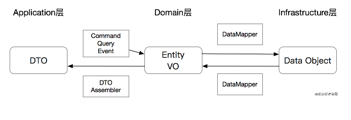

## Application层

###Application层的几个核心类：

- ApplicationService应用服务：最核心的类，负责业务流程的编排，但本身不负责任何业务逻辑
- DTO Assembler：负责将内部领域模型转化为可对外的DTO
- Command、Query、Event对象：作为ApplicationService的入参
- 返回的DTO：作为ApplicationService的出参

Application层最核心的对象是ApplicationService，它的核心功能是承接“业务流程“。但是在讲ApplicationService的规范之前，
必须要先重点的讲几个特殊类型的对象，即Command、Query和Event。

###Command、Query、Event对象

从本质上来看，这几种对象都是Value Object，但是从语义上来看有比较大的差异：
- Command指令：指调用方明确想让系统操作的指令，其预期是对一个系统有影响，也就是写操作。通常来讲指令需要有一个明确的返回值
（如同步的操作结果，或异步的指令已经被接受）。
- Query查询：指调用方明确想查询的东西，包括查询参数、过滤、分页等条件，其预期是对一个系统的数据完全不影响的，也就是只读操作。
- Event事件：指一件已经发生过的既有事实，需要系统根据这个事实作出改变或者响应的，通常事件处理都会有一定的写操作。
事件处理器不会有返回值。这里需要注意一下的是，Application层的Event概念和Domain层的DomainEvent是类似的概念，但不一定是同一回事，
这里的Event更多是外部一种通知机制而已。

###CQE的规范：
- 所以在Application层的接口里，强力建议的一个规范是：
- -规范：ApplicationService的接口入参只能是一个Command、Query或Event对象，CQE对象需要能代表当前方法的语意。
唯一可以的例外是根据单一ID查询的情况，可以省略掉一个Query对象的创建
- CQE作为**入参**
- 避免复用CQE

# **Application Service 是业务流程的封装，不处理业务逻辑**
- 不要有if/else分支逻辑：也就是说代码的Cyclomatic Complexity（循环复杂度）应该尽量等于1
- 通常有分支逻辑的，都代表一些业务判断，应该将逻辑封装到DomainService或者Entity里。但这不代表完全不能有if逻辑，比如，在这段代码里：
    boolean withholdSuccess = inventoryService.withhold(cmd.getItemId(), cmd.getQuantity());
    if (!withholdSuccess) {
    throw new IllegalArgumentException("Inventory not enough");
    }
    虽然CC > 1，但是仅仅代表了中断条件，具体的业务逻辑处理并没有受影响。可以把它看作为Precondition。

### DTO Assembler（可以引用MapStruct）
一个经常被忽视的问题是 ApplicationService应该返回 Entity 还是 DTO？这里提出一个规范，在DDD分层架构中：

ApplicationService应该永远返回DTO而不是Entity

为什么呢？
- 构建领域边界：ApplicationService的入参是CQE对象，出参是DTO，这些基本上都属于简单的POJO，来确保Application层的内外互相不影响。
- 降低规则依赖：Entity里面通常会包含业务规则，如果ApplicationService返回Entity，则会导致调用方直接依赖业务规则。
如果内部规则变更可能直接影响到外部。
- 通过DTO组合降低成本：Entity是有限的，DTO可以是多个Entity、VO的自由组合，一次性封装成复杂DTO，
或者有选择的抽取部分参数封装成DTO可以降低对外的成本。
因为我们操作的对象是Entity，但是输出的对象是DTO，这里就需要一个专属类型的对象叫DTO Assembler。DTO Assembler的唯一职责是将一个或多个Entity/VO，转化为DTO。注意：DTO Assembler通常不建议有反操作，也就是不会从DTO到Entity，因为通常一个DTO转化为Entity时是无法保证Entity的准确性的。
通常，Entity转DTO是有成本的，无论是代码量还是运行时的操作。手写转换代码容易出错，为了节省代码量用Reflection会造成极大的性能损耗。所以这里我还是不遗余力的推荐MapStruct这个库。MapStruct通过静态编译时代码生成，通过写接口和配置注解就可以生成对应的代码，且因为生成的代码是直接赋值，其性能损耗基本可以忽略不计。

### Result vs Exception
最后，上文曾经提及在Interface层应该返回Result，在Application层应该返回DTO，在这里再次重复提出规范：
- Application层只返回DTO，可以直接抛异常，不用统一处理。所有调用到的服务也都可以直接抛异常，除非需要特殊处理，否则不需要刻意捕捉异常

异常的好处是能明确的知道错误的来源，堆栈等，在Interface层统一捕捉异常是为了避免异常堆栈信息泄漏到API之外，但是在Application层，
异常机制仍然是信息量最大，代码结构最清晰的方法，避免了Result的一些常见且繁杂的Result.isSuccess判断。所以在Application层、Domain层，
以及Infrastructure层，遇到错误直接抛异常是最合理的方法。
